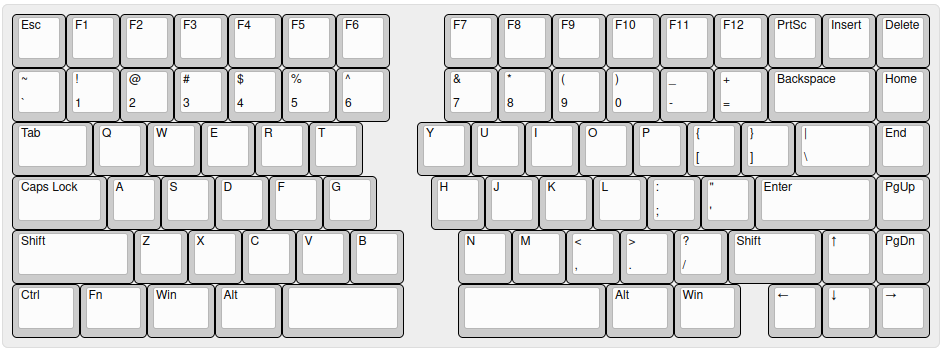
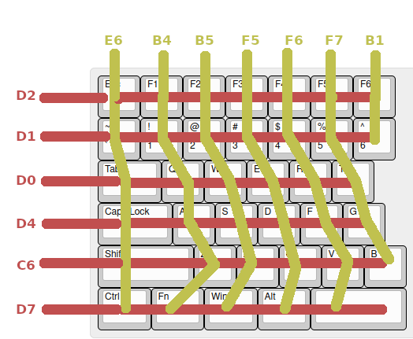
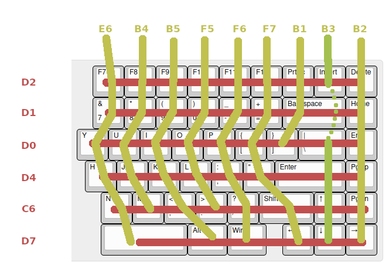

# TSExt
## A 3D-printed hand-wired split keyboard inspired from TS65

This is my attempt at designing an extended version of the [TS65](https://github.com/mohitg11/TS65AVR). The main motivation is that I wanted more keys and the ability to hand solder everything instead of making a PCB. The keyboard is powered by [QMK](https://qmk.fm/).

[Keyboard layout permaling](http://www.keyboard-layout-editor.com/##@@=Esc&=F1&=F2&=F3&=F4&=F5&=F6&_x:1%3B&=F7&=F8&=F9&=F10&=F11&=F12&=PrtSc&=Insert&=Delete%3B&@=~%0A%60&=!%0A1&=%2F@%0A2&=%23%0A3&=$%0A4&=%25%0A5&=%5E%0A6&_x:1%3B&=%2F&%0A7&=*%0A8&=(%0A9&=)%0A0&=%2F_%0A-&=+%0A%2F=&_w:2%3B&=Backspace&=Home%3B&@_w:1.5%3B&=Tab&=Q&=W&=E&=R&=T&_x:1%3B&=Y&=U&=I&=O&=P&=%7B%0A%5B&=%7D%0A%5D&_w:1.5%3B&=%7C%0A%5C&=End%3B&@_w:1.75%3B&=Caps%20Lock&=A&=S&=D&=F&=G&_x:1%3B&=H&=J&=K&=L&=%2F:%0A%2F%3B&=%22%0A'&_w:2.25%3B&=Enter&=PgUp%3B&@_w:2.25%3B&=Shift&=Z&=X&=C&=V&=B&_x:1%3B&=N&=M&=%3C%0A,&=%3E%0A.&=%3F%0A%2F%2F&_w:1.75%3B&=Shift&=%E2%86%91&=PgDn%3B&@_w:1.25%3B&=Ctrl&_w:1.25%3B&=Fn&_w:1.25%3B&=Win&_w:1.25%3B&=Alt&_a:7&w:2.25%3B&=&_x:1&w:2.75%3B&=&_a:4&w:1.25%3B&=Alt&_w:1.25%3B&=Win&_x:0.5%3B&=%E2%86%90&=%E2%86%93&=%E2%86%92)



The changes I have made are:

- Added an extra row for F-keys
- An extra column for Home,End,PgUp and PgDown
- Redesigned the plate to allow for switch mounting
- Added some extra space on the top of the keyboard to house all the electronics
- Added an Fn key

## How to build
### Materials
1. About 300 grams of material
2. 30 hours of print time (on an Ender 3)
3. 11 M2x10 screws and 4x4x6 brass heat inserts
4. 2 Arduino Pro-micro
5. A USB2.0 breakout board or some other way to extend the micro usb port of the Arduino
6. 85 Cherry MX switches and keycaps
7. 85 diodes 1n4148 (or equivalent)

### Printing the case
Printing the case should be simple but takes some time. No need for supports. I recommend adding a brim and lowering the fan to prevent warping.

**Top parts**: I used 100% infill to reduce flex as much as possible

**Bottom parts**: anything above 50% should work ok. Print due to the shape of the print the print time is almost the same regardless of the infill.

### Soldering
Follow the [QMK guide](https://docs.qmk.fm/#/hand_wire?id=soldering-the-diodes) for hand-wiring and soldering keyboards.

Wiring diagrams




Take note that on the right side, pin `B3` is connected to Insert->Backslash->Enter->Up->Down and *NOT* backspace.

The pin for serial communication between the left and right Arduinos is `D3`

### Flashing
There are two Arduinos used in total, one for each side. Each arduino needs to be flashed with their own qmk firmware. To do this you will need a local installation of [qmk-firmware](https://github.com/qmk/qmk_firmware/). 

To start flashing you keyboard, copy the *TSExt* folder from the *firmware* folder to *qmk_firmware/keyboards*. The directory structure should be

```
qmk_firmware
|
|-- keyboards
    |
    |-- TSExt
```

To flash the left Arduino
```
make TSExt:avrdude-split-left 
```

and the right one
```
make 000ts85:avrdude-split-right
```

